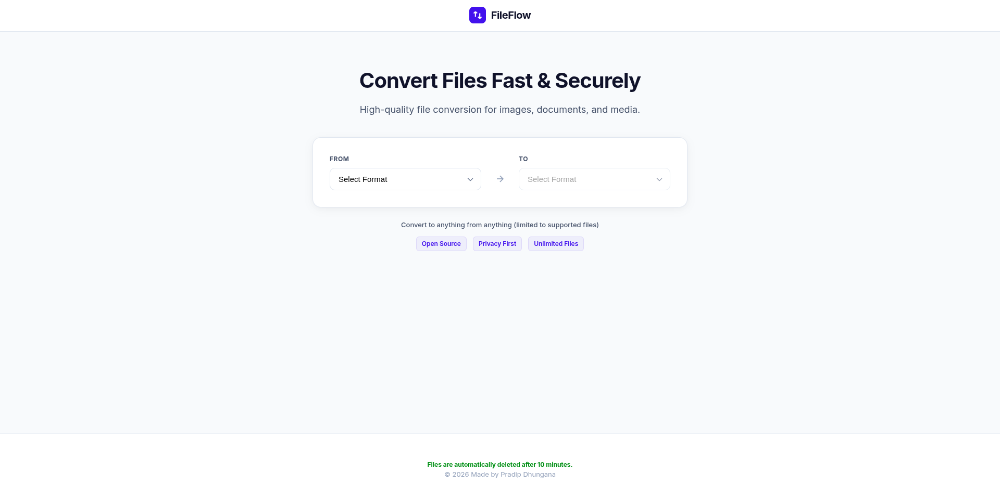

# FileFlow

FileFlow a file conversion utility designed with security and speed in mind.

## Features

- **Multi-Format Support**: 
  - **Images**: JPG, PNG, WebP, GIF, BMP, TIFF (via ImageMagick & LibreOffice)
  - **Documents**: PDF, DOCX, TXT, ODT, XLSX, PPTX (via LibreOffice Headless)
  - **Media**: MP4, MP3, WebM, WAV (via FFmpeg)
- **Zero-Trust Security**: 
  - Server-side MIME type sniffing (Apache Tika).
  - Signed ephemeral tokens for job security.
  - Automatic file cleanup (10-minute expiry).
- **High Performance**: Built on Spring Boot WebFlux for non-blocking, reactive processing.
- **Modern UI**: Professional SaaS-style interface with real-time conversion progress.
- **Automated Testing**: Built-in integration test suite for verifying all conversion paths.

## 🛠 Tech Stack

### Backend
- **Java 21**
- **Spring Boot 3 (WebFlux)**
- **Apache Tika** (MIME Detection)
- **Bucket4j** (Rate Limiting)
- **JJWT** (Job Tokens)

### Frontend
- **React (TypeScript)**
- **Vite**
- **Vanilla CSS** (Design System)

### Native Dependencies
The following tools must be installed on the host system:
- `ffmpeg`
- `imagemagick`
- `libreoffice-writer` / `libreoffice-common`
- `pandoc`

### Output



## Getting Started

### Prerequisites
- JDK 21+
- Node.js 18+
- Maven 3.9+

### Backend Setup
1. Navigate to the backend directory:
   ```bash
   cd backend
   ```
2. Run the application:
   ```bash
   mvn spring-boot:run
   ```

### Frontend Setup
1. Navigate to the frontend directory:
   ```bash
   cd frontend
   ```
2. Install dependencies:
   ```bash
   npm install
   ```
3. Run the development server:
   ```bash
   npm run dev
   ```


### Running Integration Tests
To verify all conversion paths are working on your system:
```bash
cd backend
./test-conversions.sh
```

## Security
- All uploaded files are stored in an isolated temporary directory.
- Files and conversion metadata are automatically purged after 10 minutes.
- Conversions are executed in sandboxed child processes.

## License
This project is Open Source.

---
Made by Pradip Dhungana
